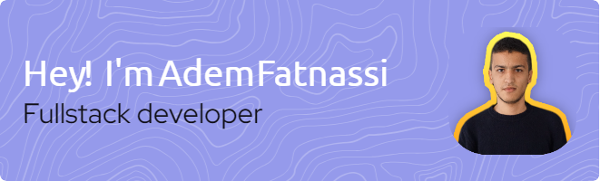

<h1 align="center">Hi there 👋, I'm Adem Fatnassi</h1>  
<h3 align="center">I'm a software developer. 

I create user-friendly applications and tackle complex challenges. 

My passion lies in keeping up with the latest technology trends</h3>  
  

  
  
  

  
  
  
- 🔭 I’m currently working on **Next.js Project**  
  
- 🌱 I’m currently learning **Next.js, Redux ToolKit**  
  
- 👨‍💻 All of my projects are available at [https://ademfatnassi.github.io](https://ademfatnassi.github.io)  
  
- 💬 Ask me about **Angular, Node.js, Express.js**  
  
- 📫 How to reach me **fatnassiadem99@gmail.com**  
  
- 📄 Know about my experiences [https://ademfatnassi.github.io/](https://ademfatnassi.github.io/)  
  
<h3 align="left">Connect with me:</h3>  

  
  
  

  
  
<h3 align="left">Languages and Tools:</h3>  

                                       
  
  

  
  

